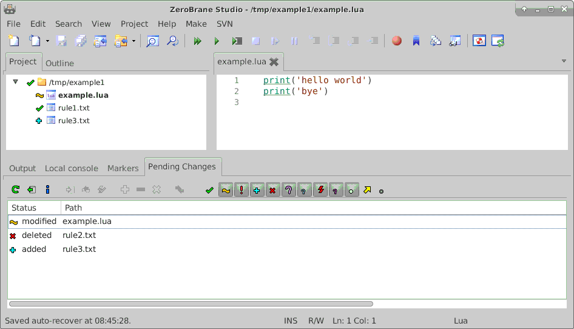

# zbssvn

This package adds subversion support to ZeroBrane Studio (ZBS)

---

**NOTE** **NOTE** **NOTE** **NOTE** **NOTE** **NOTE** **NOTE** **NOTE** **NOTE**  
**NOTE** this is currently WorkInProgress !  
**NOTE** this note will be removed as soon as zbssvn is commited in a useable state.   
**NOTE** **NOTE** **NOTE** **NOTE** **NOTE** **NOTE** **NOTE** **NOTE** **NOTE**  

---

# Prerequisites:

* ZeroBraneStudio 1.70 (or newer) [1]
* subversion command line client [2]

# Installation:

First you have to find out, where your local user settings is stored.
This depends on the operation system. The easiest way is to ask ZBS:

* Start ZeroBraneStudio

* Invoke "Edit"/"Preferences"/"Settings: User"  
  => A file will be opened called "user.lua" (you will need this later on)

* Do a RightMouseClick on the editors "user.lua" tab and invoke "Show Location"  
  => Your file browser will be opened in a folder

**This is the folder where the package shall be installed !**

Next you have install zbssvn at the right place:

* If not existent, create a "packages" folder there

* Enter the packages folder and open a command line window *in* this folder

* Then (on commandline) check out the package [3]  
      ```  
      svn co https://github.com/Minebea-Intec/zbssvn.git/trunk zbssvn  
      ```  
      => you should now have a folder "zbssvn" in "packages"

* Finally (in ZBS) in "Edit"/"Preferences"/"Settings: User" add the line    
  `package"zbssvn/zbssvn.lua"`  
  save file and restart ZBS

# Usage

To have an effect in ZBS, you have to start ZBS with a project, which _has_ been checked out from a subversion repository.
For now there is no option to checkout or import a project from within ZBS.

zbssvn will then show the status of each file


In the pending changes tab there are two types of icons.

On the left hand "actions". A tooltip will show the action performed on the icon. The icon will only be enabled, if action is possible on the selected items in the tab.

Most of the action will show either a simple confirmation dialog or a bigger subversion dialog. The bigger dialog may contain

- a comment field, where you can enter a commit comment.
- a combobox showing the last commit comments.
- a checkbox list with the files. Action will only take place for marked files
- a diff area. Will show the diff of a file, when selected in the file list.

Not all elements are always shown, this may depend on the selected action.

On the right hand is a list of "status" icons. By these you can toggle, of which status files shall be displayed in the pending changes tab.

# ToDo

- [ ] add user documentation
- [ ] allow to checkout or import a project
- [ ] repository browser
- [ ] standalone (use as svn gui without ZBS)
- [x] blame command
- [x] make svn ignore work without external tool

-----

[1] https://studio.zerobrane.com/

[2] Linux : see https://wiki.ubuntuusers.de/Archiv/Subversion/  
Windows : see https://tortoisesvn.net/     (remember to check 'command line' during installation)

[3] You could also use `git clone` or download the master.zip and extract it. But because this package is focused on subversion, we suggest the svn command.